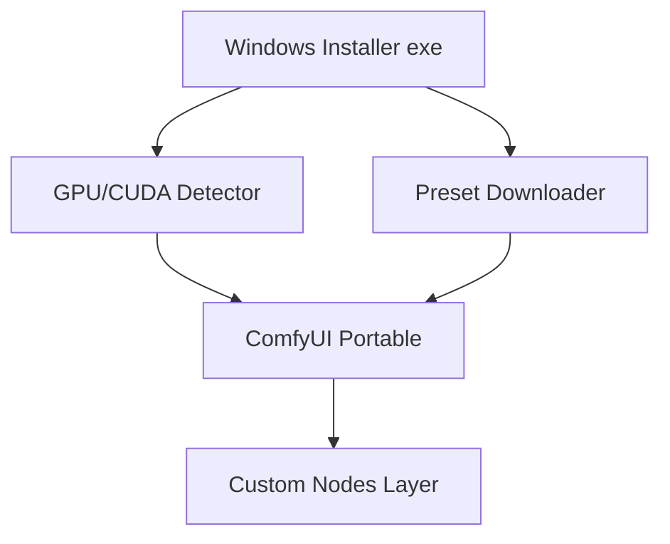

# Фаза 2: полный ComfyUI-инсталлятор (design spike)

> Документ для будущей реализации. Запускать **только после** успеха фазы 1 (Windows Preset Downloader).

## Цель

One-click установщик для локального Windows: ComfyUI + custom nodes + правильный torch/CUDA + интеграция Preset Downloader.

## Не цель

- Заменить RunPod Docker (облако остаётся отдельным каналом)
- Конкурировать 1:1 с ComfyUI Desktop / Stability Matrix по всем фичам

## Уникальное позиционирование

**«ComfyUI + каталог Wan/Qwen/Flux пресетов Смышникова + one-click download моделей»**

## Архитектура (черновик)

## Компоненты

### 1. GPU / CUDA detection

| Шаг | Действие |
|-----|----------|
| nvidia-smi | Версия драйвера, модель GPU |
| Матрица | Переиспользовать логику из Docker: cu124–cu130 |
| Fallback | CPU-only режим (предупреждение) |

Источник правды: [`Dockerfile`](Dockerfile), `comfy_pytorch_pin.txt`, [`README_RUNPOD.md`](README_RUNPOD.md) (таблица GPU → CUDA).

### 2. ComfyUI portable

- Embedded Python 3.11 (отдельный от Downloader или общий runtime — TBD)
- `git clone` ComfyUI + ComfyUI-Manager
- venv + `pip install torch` с `download.pytorch.org` index
- Патч CUDA mem: [`scripts/patch_comfy_cuda_mem.py`](scripts/patch_comfy_cuda_mem.py)

### 3. Custom nodes

- Список из [`custom_nodes.txt`](custom_nodes.txt) / [`custom_nodes_base.txt`](custom_nodes_base.txt)
- Установка через Manager API или скрипт (как [`scripts/install_custom_nodes.sh`](scripts/install_custom_nodes.sh))
- Риск: конфликты pip — нужен lockfile или поэтапная установка с проверкой

### 4. Preset Downloader

- Уже реализован в фазе 1 ([`desktop/`](desktop/))
- Post-install: записать `comfyui_path` в config, ярлык «Скачать пресеты»

### 5. Workflow (опционально)

- Копирование `presets/wan/`, `presets/qwen/` → `ComfyUI/user/default/workflows/`
- Логика из [`scripts/pre_start.sh`](scripts/pre_start.sh)

## Оценка сложности

| Блок | Недели | Риск |
|------|--------|------|
| CUDA/GPU detect | 1 | Средний |
| ComfyUI + torch | 2 | Высокий |
| Custom nodes | 2–4 | Очень высокий |
| Installer UI (Inno/WiX) | 1 | Низкий |
| Updater | 2 | Средний |
| QA (10+ GPU конфигов) | 2 | Высокий |

**Итого:** ~2–3 месяца при part-time.

## Альтернативы (меньше поддержки)

1. **Интеграция в Stability Matrix** — package/extension с вашими манифестами
2. **ComfyUI Desktop plugin** — если API позволит
3. **Только Downloader + видео «как установить ComfyUI»** — минимум поддержки

## Критерии старта фазы 2

- [ ] 100+ скачиваний Preset Downloader
- [ ] Стабильные отзывы по скачиванию моделей на Windows
- [ ] Ресурс на поддержку GPU-матрицы и обновлений nodes

## Следующий шаг при GO

1. Репозиторий `desktop/full-installer/` или отдельный repo
2. Spike: скрипт `detect_cuda.ps1` + установка torch на чистой VM
3. Прототип без custom nodes (minimal) → затем base/full профили как в Docker
